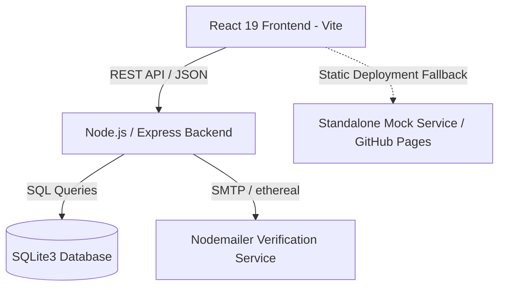

# TripMate System Architecture

TripMate is a full-stack modern travel planning and discovery application engineered with high performance, modularity, and an intuitive user interface.

## System Overview

## Key Components

### 1. Frontend (`/frontend`)
- **Framework**: React 19 with Vite for ultra-fast HMR and bundling.
- **Styling**: Vanilla CSS design system with fluid typography, responsive flex/grid layouts, and glassmorphism.
- **Icons**: Lucide React.
- **Context Providers**:
  - `CurrencyContext`: Real-time multi-currency conversion (USD, EUR, GBP, INR, JPY, CAD, AUD).
  - `AuthContext`: Client-side JWT session state, login, and registration.
- **Resilience**: Standalone demo mode support allowing the frontend to operate seamlessly on GitHub Pages without an active backend server.

### 2. Backend (`/backend`)
- **Runtime**: Node.js with Express 5.
- **Database Engine**: SQLite3 (`tripmate.db`) with relational tables and foreign keys.
- **Authentication**: JWT (JSON Web Tokens) with salted `bcryptjs` password hashing.
- **Mailing**: Nodemailer integration with support for both live SMTP and mock test mailboxes.

### 3. Data Flow & Security
- **CORS Protection**: Configurable origins for frontend development and deployment.
- **Token Authorization**: Bearer token authentication via HTTP headers for protected endpoints.
- **Safe Fallbacks**: Auto-detection of backend availability for offline/showcase demonstrations.
